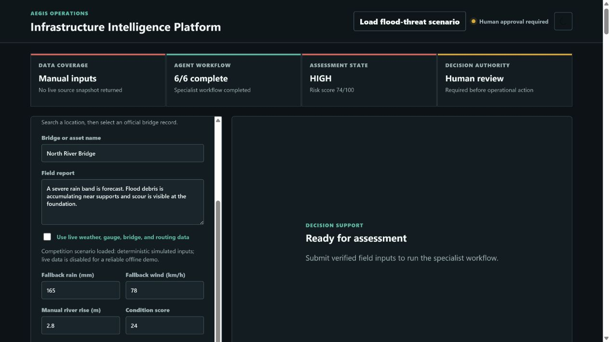
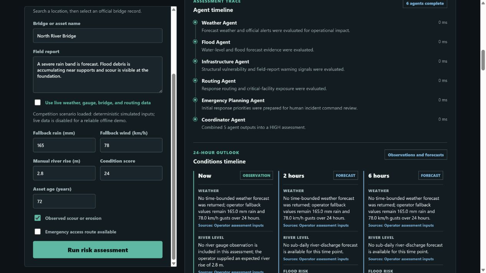
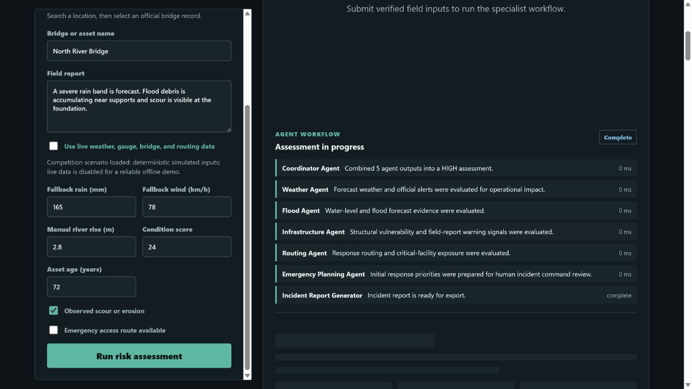
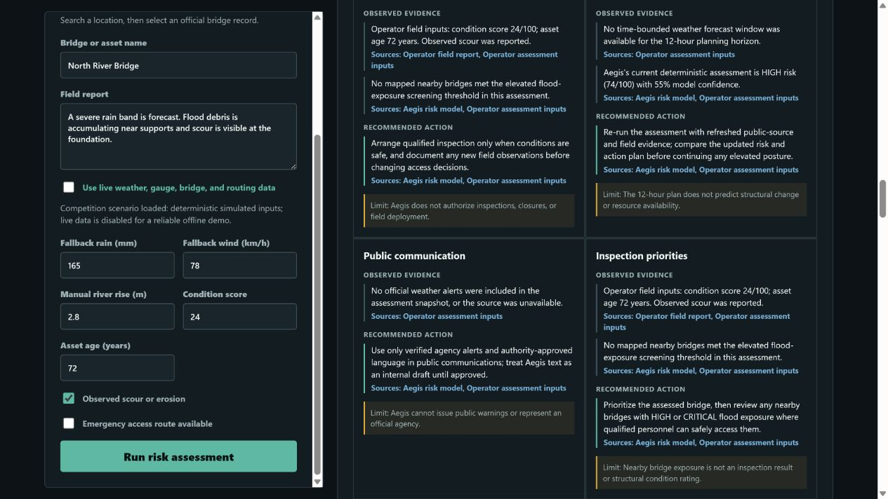
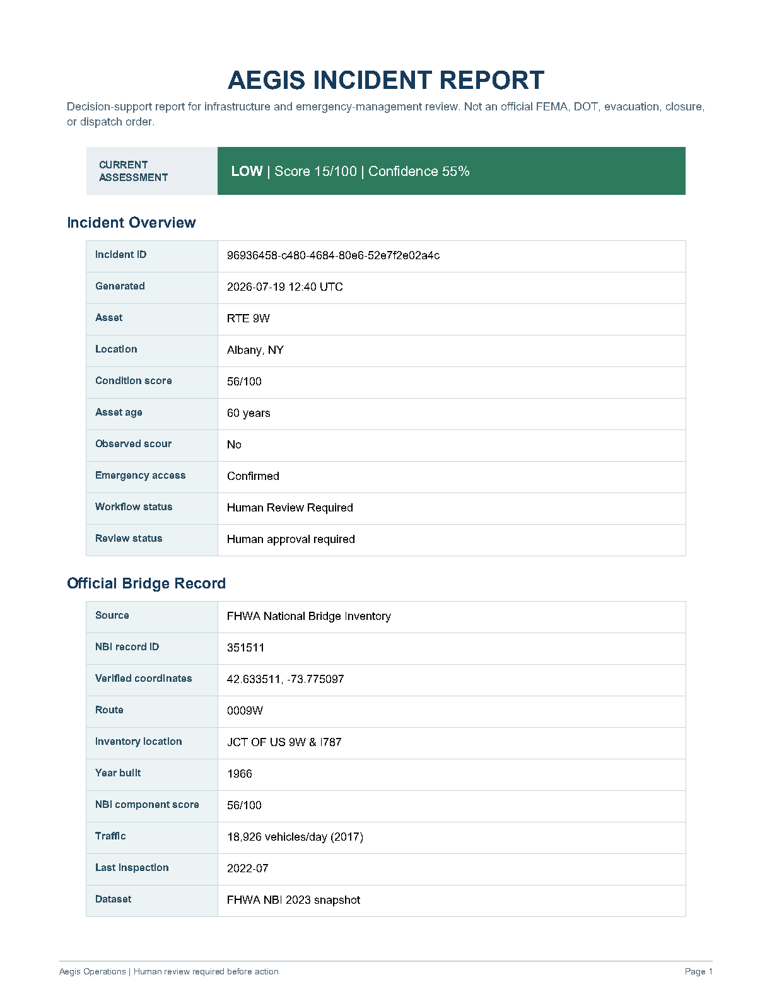

# Aegis

Aegis is an AI-powered infrastructure intelligence platform that helps emergency managers identify bridge risks by combining live environmental conditions, infrastructure data, and explainable AI reasoning. The current implementation is an emergency decision-support MVP: a qualified engineer or emergency authority must review every recommendation before action.

## What the MVP does

1. An operator enters a U.S. city, state, or ZIP code and selects a nearby bridge from the official FHWA National Bridge Inventory. Manual asset metadata remains available only when an official record is unavailable.
2. Aegis retrieves the selected bridge's official coordinates, year built, traffic information, and available component-condition codes, then retrieves public weather, flood forecast, river gauge, official alert, earthquake, radar, terrain, response-facility, and routing evidence when the sources are available.
3. Aegis collects live public evidence once, then concurrently runs the Weather, Flood, Infrastructure, and Routing agents against that shared snapshot.
4. The Emergency Planning Agent prepares human-review priorities, and the Coordinator Agent validates all structured outputs and calculates the deterministic `LOW`, `MODERATE`, `HIGH`, or `CRITICAL` risk result.
5. The dashboard shows a visual, source-cited breakdown of the deterministic score, including evidence that increases or reduces risk, confidence limits, missing data, map layers, an AI Incident Commander brief with citations, recommended precautions, a draft public message, and a situation report awaiting human approval.
6. A source-limited 24-hour timeline distinguishes current observations from forecasts at 2, 6, 12, and 24 hours. It reports unavailable sub-daily river or structural forecasts as data limits instead of estimating them.
7. The live emergency feed refreshes verified National Weather Service weather and flood alerts every minute after an assessment. For New York locations, it can also read official 511NY road and bridge events when `NY511_API_KEY` is configured; Aegis assessments always appear in a separate, clearly labeled panel.
8. The nearby bridge inventory ranks up to 30 mapped bridges by flood exposure, facility-proximity importance, and access impact. It labels all proxy estimates and does not represent nearby bridge exposure as a structural inspection result.
9. Every completed assessment produces a phased emergency action plan covering immediate actions, 30-minute, 2-hour, and 12-hour planning, public communication, inspection priorities, and resource deployment. Each section separates observed evidence from recommendations and retains source citations.
10. Every completed assessment automatically creates a professional PDF incident report. The dashboard provides an export link while the report is retained.

The risk scoring model remains deterministic and inspectable. Live public data is evidence, not a substitute for engineering review. The flood overlay is a screening area, not an official floodplain, evacuation zone, or closure recommendation. A city or area search resolves to a city-level map coordinate, not a verified bridge position. Verify asset coordinates before using map proximity, flood-screening, or routing information operationally. The current OSRM line is an illustrative regional path, not a verified alternate crossing or road-closure detour; production routing needs verified bridge geometry, origin/destination, and authoritative closure data.

## Product vision: from risk assessment to infrastructure intelligence

Today, Aegis combines weather and flood evidence, bridge inventory records, and specialist AI agents into an explainable risk assessment and emergency decision-support workflow.

The long-term vision is an **Infrastructure Intelligence Platform**: a continuously updated operational picture that brings together satellite imagery, IoT bridge sensors, validated historical failures, computer-vision inspection findings, digital-twin simulations, and AI agents. Rather than claiming to predict a collapse, this platform would help qualified teams detect changing conditions, understand system-level consequences, prioritize inspections and resources, and make defensible, human-approved decisions across critical infrastructure.

That evolution depends on validated engineering thresholds, governed data partnerships, calibrated models, cybersecurity controls, and sustained human oversight. These are future capabilities, not claims about the current MVP.

For the staged transition from deterministic scoring to validated ML-based elevated-risk screening, see [AI/ML Improvement Roadmap](docs/AI_ML_ROADMAP.md).

## Architecture

For the full system diagram and flow, see [Architecture](docs/architecture.md).

```text
Browser dashboard
       |
FastAPI /api/assessments
       |
IncidentCoordinator (async)
       |
shared evidence -> concurrent specialist agents -> planning -> Coordinator Agent
       |
typed assessment response + audit trail
```

The existing `POST /api/assessments` endpoint remains available for integrations. The dashboard uses `POST /api/assessments/stream`, an NDJSON stream that emits real agent start, completion, degradation, and report-generation events before the final assessment result. A single failed agent never stops the Coordinator from returning a partial, clearly labeled assessment.

The Groq adapters are isolated in `backend/app/services/groq.py` and `backend/app/services/commander.py`. The Commander receives only the collected, source-labeled facts. It cannot change Aegis's deterministic risk level, and every displayed reasoning or recommendation item must cite a source ID that exists in the assessment. If Groq is unavailable, returns malformed JSON, changes the risk level, or cites an unknown source, Aegis displays a deterministic, source-cited fallback instead.

`backend/app/services/bridge_catalog.py` provides a server-verified U.S. bridge-selection flow using the FHWA National Bridge Inventory. The hosted layer is a 2023 snapshot, so it is official inventory data rather than a real-time structural sensor feed. `backend/app/services/live_data.py` contains isolated adapters for Open-Meteo, USGS, the National Weather Service, RainViewer, OpenStreetMap/Overpass, and OSRM. Each request has a short timeout and fails independently, so an unavailable public source never blocks an assessment. NWS alerts are US-only; RainViewer radar is a visual, best-effort layer; modelled flood discharge and the flood screening overlay are not official flood zones or evacuation orders.

`backend/app/services/pdf_report.py` creates a server-side, source-traceable incident report from the completed assessment. It includes bridge information, risk analysis, weather and flood evidence, an operational map diagram, alternate-route details, Commander recommendations, confidence, sources, and known gaps. PDFs are stored only in memory for one hour and are lost when the application restarts. A production deployment should move PDFs to authenticated, encrypted object storage.

## Installation

1. Install Docker Desktop.
2. Copy `.env.example` to `.env` and add your key only when you are ready:

   ```text
   GROQ_API_KEY=your_real_key
   GROQ_MODEL=the_model_you_choose
   ENABLE_GROQ_ENRICHMENT=true
   ENABLE_GROQ_INCIDENT_COMMANDER=true
   POSTGRES_PASSWORD=use-a-strong-production-secret
   ```

3. From this folder, run:

   ```powershell
   docker compose up --build
   ```

4. Open `http://localhost:8000`.

To use the app without Groq, leave both Groq feature flags as `false`. The assessment workflow remains fully functional. When enabled, the dashboard shows whether an assessment used Groq writing enhancement, Groq evidence synthesis, or a deterministic fallback.

The emergency feed always includes National Weather Service weather and flood alerts when available. To enable official New York road and bridge events, add `NY511_API_KEY=your_511ny_developer_key` to `.env`. The key stays server-side and is never sent to the browser.

## API documentation

When Aegis is running locally, interactive OpenAPI documentation is available at [http://localhost:8000/docs](http://localhost:8000/docs), and the OpenAPI schema is available at [http://localhost:8000/openapi.json](http://localhost:8000/openapi.json).

Key endpoints:

- `POST /api/assessments` — return a completed deterministic assessment.
- `POST /api/assessments/stream` — stream agent progress and the final assessment as NDJSON.
- `POST /api/assessments/{assessment_id}/decisions` — record a human operator decision when durable audit storage is configured.

The public API has no authentication in this MVP. Do not expose it to operational users until identity, role-based authorization, shared rate limiting, and HTTPS controls are in place.

## Deploy on Render

The repository includes `render.yaml` for a free Render web-service deployment. It deploys the FastAPI dashboard without the optional Postgres/PostGIS audit database so the public demo can run with no provider keys. In Render, select **New > Blueprint**, choose this repository and its `main` branch, name the Blueprint `aegis-demo`, then deploy it. Add Groq or 511NY keys only through Render's encrypted environment-variable settings, never to Git.

## Screenshots

Final submission screenshots are tracked in [docs/screenshots](docs/screenshots/README.md). The dashboard captures use the repeatable simulated flood-threat scenario and are clearly labeled as decision support, not an engineering certification. The report capture is from a live Albany, NY verification that resolved an official FHWA NBI record.

| Dashboard | Explainability | Workflow |
| --- | --- | --- |
|  |  |  |

| Evidence quality | PDF incident report |
| --- | --- |
|  |  |

## Durable Audit Storage

Docker Compose starts PostgreSQL with PostGIS and initializes the audit schema in `backend/db/init.sql`. When `DATABASE_URL` is configured (it is set automatically for the Compose API service), Aegis persists each completed assessment with its bridge ID and geometry when available, timestamp, request, risk score and level, evidence snapshot, source snapshot, and final response snapshot.

The `POST /api/assessments/{assessment_id}/decisions` endpoint records an operator identifier, decision, rationale, and timestamp against that immutable assessment ID. This creates an auditable decision trail, but it must be protected with real authentication and role-based authorization before deployment beyond a controlled environment.

## Security Notes

- `.env` is ignored by Git. Keep all provider keys there and rotate any key that was ever shared in chat, committed, or exposed in a log.
- Aegis adds browser security headers, limits public assessment requests in a single app process, runs its container without Linux root privileges or extra capabilities, and sends Groq structured assessment facts rather than the raw field report.
- This MVP has no accounts or authorization. The audit database records submitted operator identifiers but cannot verify identity until authentication is added. PDF report URLs use unguessable identifiers and short-lived in-memory storage; a public deployment must add authenticated access, role-based authorization, a shared rate-limit store, encrypted PDF storage, and a trusted reverse proxy configured for HTTPS before handling sensitive operational data.

## Competition Demo

Use the **Load flood-threat scenario** control for a transparent, repeatable two-minute demonstration. The full presentation script is in `docs/DEMO_SCRIPT.md`, and portable scenario fixtures are in `demo/`. The built-in scenario disables live data, so its deterministic assessment works even when public APIs are unavailable; it is visibly labeled as simulated.

## Built with Codex and GPT-5.6

Codex, using GPT-5.6, was used as a development collaborator to turn Aegis into a working Dockerized FastAPI application with live public-data integrations, an asynchronous multi-agent workflow, official bridge lookup, explainable deterministic risk assessment, a modern dashboard, PDF incident reports, and supporting documentation.

During the Build Week submission period, Codex was used to:

- Reposition Aegis from a collapse-prediction claim to an infrastructure-intelligence and emergency decision-support platform.
- Create reliable offline judge-demo scenarios, architecture and AI/ML-roadmap documentation, source-quality and agent-flow visualizations, and a PostgreSQL/PostGIS audit foundation.
- Improve the product narrative, safety boundaries, testing, and submission readiness.

The current hardening focus is deliberate end-to-end testing with real cities, demo polish, consistent Aegis branding, and clear communication that Aegis supports qualified human decisions—it is not a certified engineering prediction system.

Codex `/feedback` Session ID from the primary build thread: `019f7556-2ac8-7ce3-b26c-eb8a6dcc3210`.

## Test

After Python is available, from `backend` run:

```powershell
python -m pip install -e ".[dev]"
python -m pytest
```

Latest local verification: 28 tests passed, including PDF-report generation. A live Albany, NY check also resolved FHWA NBI record `351511` and produced a valid PDF export.

## Next production milestones

- Add authenticated NASA FIRMS wildfire and satellite imagery adapters only after obtaining their free provider keys and reviewing their terms.
- Add database-backed source snapshots and an operator audit trail so assessments are reproducible after public data changes.
- Add a Postgres/PostGIS audit database and role-based access control.
- Add map layers and an operator approval workflow.
- Calibrate the scoring model with historical, validated bridge incident data and evaluate it with precision/recall metrics before operational use.

## License

This project is released under the [MIT License](LICENSE).
