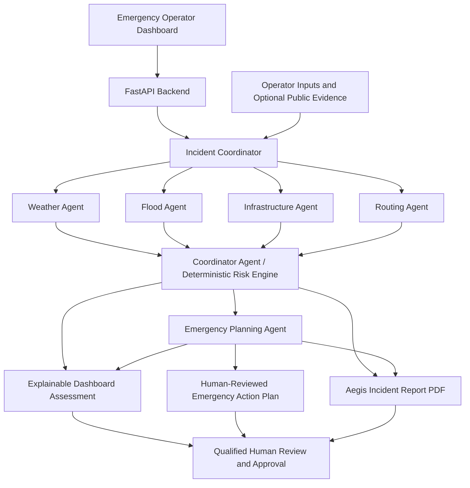

# Aegis Architecture

Aegis is an AI-powered infrastructure intelligence and emergency decision-support MVP. The architecture separates evidence collection, specialist analysis, deterministic risk coordination, and human-reviewed operational outputs.

## Flow

1. An emergency operator submits field observations and bridge information through the dashboard.
2. The FastAPI backend validates the request and the Incident Coordinator collects shared evidence. Live public sources are optional; offline judge scenarios use deterministic simulated inputs.
3. Weather, Flood, Infrastructure, and Routing agents evaluate the same evidence snapshot concurrently.
4. The Coordinator Agent combines agent findings into an explainable, deterministic risk score. Optional AI writing support cannot alter that score.
5. The Emergency Planning Agent prepares reviewable operational guidance. The application returns the dashboard assessment, emergency action plan, and Aegis Incident Report PDF.
6. A qualified engineering or emergency authority reviews and approves any operational decision. Aegis does not issue closure orders, dispatches, or public warnings.

## Design principles

- **Explainable:** Every score contribution and recommendation identifies its evidence and limitations.
- **Resilient:** Public-source failures degrade gracefully; the offline demo uses no external APIs.
- **Human in the loop:** Outputs are decision support, not engineering certification or autonomous authority.
- **Deterministic risk scoring:** AI can assist with evidence-grounded wording but cannot change the calculated risk level.
